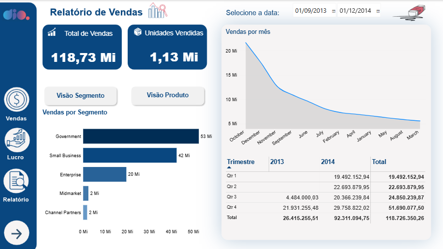
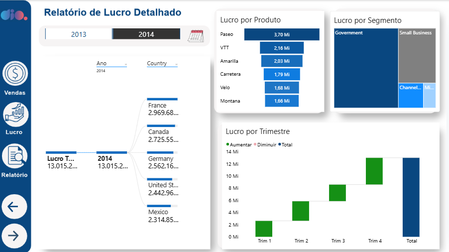
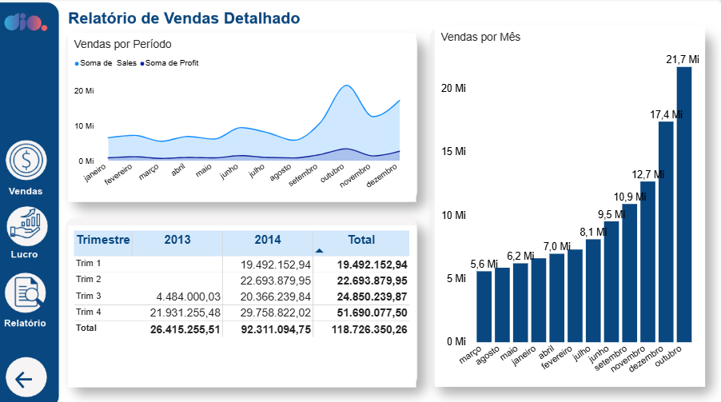

# 📊 Relatório de Vendas - Desafio DIO Power BI

---

### 🎬 Demonstração

### 🎯 Sobre o Projeto

Dashboard desenvolvido para o Desafio de Projeto da DIO - Processamento de Dados com Power BI.

### 📑 As 3 Páginas

#### 📌 Página 1 - Relatório de Vendas

- **118,73 MI** Total de Vendas
- **1,13 MI** Unidades Vendidas
- Vendas por Segmento e Vendas por Mês
- Tabela por Trimestre

#### 📌 Página 2 - Relatório de Lucro Detalhado

- Lucro por Produto, Segmento e Trimestre

#### 📌 Página 3 - Relatório de Vendas Detalhado

- Vendas por Período, Tabela por Trimestre e Vendas por Mês

### 🛠️ O que usei

- **Power BI Desktop** para criação dos visuais
- **DAX** apenas para traduzir o nome do trimestre

